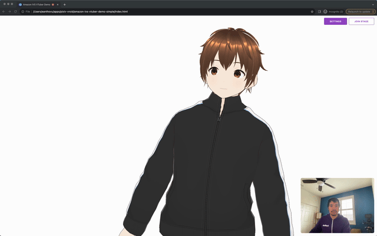

## Simple VTuber Demo for Amazon IVS

A demo web application intended as an educational tool to demonstrate how you can do VTubing on Amazon IVS.

**This project is intended for educational purposes only and not for production usage.**

**Demo:** Visit [https://dev.d218eir1ybnzul.amplifyapp.com/](https://dev.d218eir1ybnzul.amplifyapp.com/) to see a live demo.

## Prerequisites

- [AWS Account](https://docs.aws.amazon.com/ivs/latest/LowLatencyUserGuide/getting-started-create-account.html)

## Running the demo

Follow these instructions to run the demo:

1. Open index.html in a web browser

## Known issues and limitations

- The application is meant for demonstration purposes and **not** for production use.
- This application is only tested and supported on the latest Desktop versions of Chrome. Other browsers and devices, including mobile browsers and smartphones, may work with this tool, but are not officially supported at this time.

## About Amazon IVS

Amazon Interactive Video Service (Amazon IVS) is a managed live streamin solution that is quick and easy to set up, and ideal for creating interactive video experiences. [Learn more](https://aws.amazon.com/ivs/).

- [Amazon IVS docs](https://docs.aws.amazon.com/ivs/)
- [User Guide](https://docs.aws.amazon.com/ivs/latest/RealTimeUserGuide/what-is.html)
- [Getting Started with IVS Real-Time Streaming](https://docs.aws.amazon.com/ivs/latest/RealTimeUserGuide/getting-started.html)
- [Learn more about Amazon IVS on IVS.rocks](https://ivs.rocks/)
- [View more demos like this](https://ivs.rocks/examples)

## Security

See [CONTRIBUTING](CONTRIBUTING.md#security-issue-notifications) for more information.

## License

This library is licensed under the MIT-0 License. See the LICENSE file.
